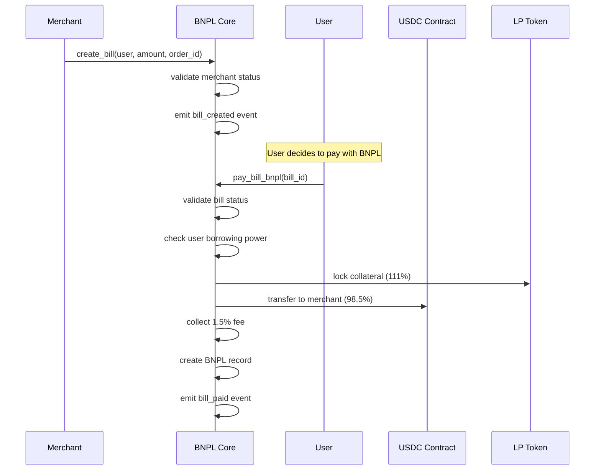
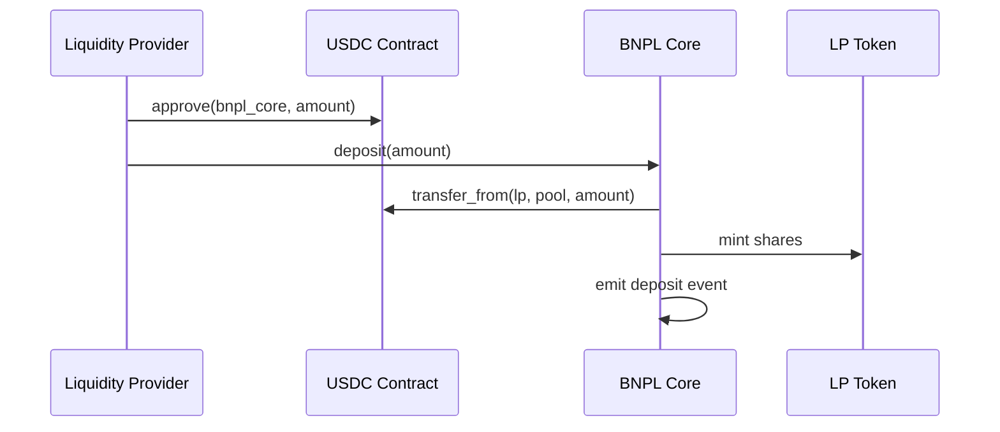
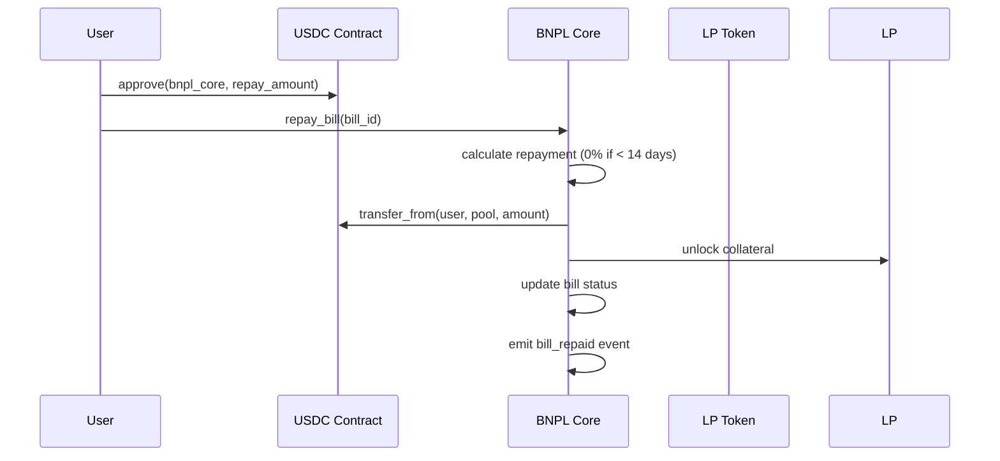

# Contract Interactions

This document provides a high-level overview of how the smart contracts interact in the LumenLater BNPL Protocol.

## Contract Overview

| Contract | Purpose | Type |
|----------|---------|------|
| BNPL Core | Main protocol logic | Protocol Contract |
| LP Token | Liquidity provider shares | Protocol Contract |
| USDC Token | Payment currency | External Stellar Asset |

*For detailed contract specifications, see the [contracts documentation](../contracts/).*

## Interaction Patterns

### 1. Bill Creation and Payment

### 2. Liquidity Provision

### 3. Loan Repayment

## Key Interaction Flows

### Complete BNPL Transaction Lifecycle

1. **Bill Creation**: Merchant creates a bill for user
2. **BNPL Payment**: User pays with BNPL (0% interest for 14 days)
   - 111% LP token collateral locked
   - 98.5% transferred to merchant
   - 1.5% fee collected for LPs
3. **Repayment**: User repays within 14 days
   - No interest charged
   - Collateral unlocked
   - Bill marked as repaid

### Liquidity Management

- **Deposit**: LPs provide USDC, receive LP tokens
- **Withdraw**: LPs burn LP tokens, receive USDC + yield
- **Yield Source**: 1.5% merchant fees from all BNPL transactions

### Liquidation Process

When a BNPL loan is overdue beyond the 14-day grace period:
- Health factor < 1.2 triggers liquidation eligibility
- Liquidator repays the debt and receives collateral + 10% bonus
- Protects the protocol from bad debt

## State Management

### Key State Elements

- **User State**: LP token balance, locked collateral, active BNPL loans
- **Protocol State**: Total liquidity, fees collected, active bills
- **Merchant State**: Enrollment status, bills created

### Atomic Operations

All contract interactions are atomic - either all succeed or all fail. This ensures consistency across the protocol.

## Performance Considerations

- **Stellar Network**: 3-5 second finality, ~$0.00001 transaction fees
- **Optimized Storage**: Efficient data structures minimize costs
- **Event System**: All important actions emit events for off-chain tracking

## Security Features

- **Access Control**: Role-based permissions (Admin, Merchant, User)
- **Input Validation**: All inputs validated before processing
- **Reentrancy Protection**: State updates before external calls
- **Over-collateralization**: 111% collateral requirement protects protocol

For detailed security implementation, see the [BNPL Core contract documentation](../contracts/bnpl-core.md).