# Data Flow Architecture

This document describes the detailed data flow patterns and state management across the LumenLater BNPL Protocol.

## Overview

The protocol manages data across three layers:
- **On-chain State**: Stored in Stellar smart contracts
- **Off-chain Storage**: Cached in MongoDB for performance
- **Real-time Updates**: Event-driven synchronization

## Complete Transaction Flows

### 1. End-to-End BNPL Transaction

```mermaid
graph TD
    subgraph "🏪 Merchant Flow"
        M1[Merchant creates bill] --> M2[Submit to Web App]
        M2 --> M3[Store in MongoDB]
        M3 --> M4[Submit to blockchain]
    end
    
    subgraph "📦 Bill Creation"
        M4 --> B1[BNPL Core validates]
        B1 --> B2[Generate bill ID]
        B2 --> B3[Emit BillCreated event]
        B3 --> B4[Event listener updates DB]
    end
    
    subgraph "💳 User Payment"
        U1[User views bill] --> U2[Chooses BNPL payment]
        U2 --> U3[Check borrowing power]
        U3 --> U4[Approve collateral]
        U4 --> U5[Execute payment]
        U5 --> U6[Create loan record]
    end
    
    subgraph "💰 Fund Distribution"
        U6 --> F1["Transfer to merchant (98.5%)"]
        F1 --> F2[Collect 1.5% fee]
        F2 --> F3[Update LP pool]
        F3 --> F4[Emit BillPaid event]
    end
    
    subgraph "🔄 Repayment"
        R1[User initiates repayment] --> R2["Calculate amount (0% if < 14 days)"]
        R2 --> R3[Transfer USDC to pool]
        R3 --> R4[Unlock LP collateral]
        R4 --> R5[Update bill status]
    end
    
    M1 --> M2
    B4 --> U1
    F4 --> R1
```

### 2. Liquidity Provider Journey

### 3. Merchant Onboarding Flow

Simple enrollment process:
1. Merchant submits application via web interface
2. Admin reviews and approves/rejects
3. Approved merchants stored on-chain
4. Merchant can start creating bills

Future versions will include automated KYB verification.

## State Management

### 1. On-Chain State Structure

### 2. Off-Chain Data Synchronization

The system uses an event-driven architecture:
- Blockchain events trigger database updates
- Event listeners ensure data consistency
- Failed events are automatically retried
- MongoDB serves as the off-chain cache for fast queries

### 3. Event Processing

**Key Events Tracked:**
- `BillCreated` - New BNPL request
- `BillPaid` - User takes BNPL credit
- `BillRepaid` - User repays BNPL
- `LiquidityDeposited` - LP adds funds
- `LiquidityWithdrawn` - LP removes funds
- `BillLiquidated` - Overdue bill liquidated

Events are processed in real-time and stored in MongoDB for off-chain queries.

## Data Consistency

### Eventual Consistency Model

The protocol uses blockchain as the single source of truth:
- All critical data is stored on-chain
- Off-chain database mirrors blockchain state
- UI shows optimistic updates for better UX
- Blockchain events reconcile any discrepancies

**Conflict Resolution:** Blockchain data always takes precedence

## Performance Optimization

### 1. Performance Optimization

**Caching Strategy:**
- Browser cache for static assets
- Database indexing for fast queries
- Event-driven cache invalidation

**Key Optimizations:**
- Indexed MongoDB collections
- Batched event processing
- Optimistic UI updates

### 2. Database Indexing

**MongoDB Collections:**
- `bills` - All BNPL transactions
- `merchant_applications` - Merchant enrollment data
- `users` - User profiles and preferences

All collections are indexed on key fields for optimal query performance.

## Error Handling and Recovery

### Event Processing Failures

**Retry Strategy:**
- Automatic retry up to 3 times with exponential backoff
- Failed events go to dead letter queue
- Admin can manually review and retry failed events

### Data Recovery

**Recovery Options:**
1. **Resync from blockchain** - For minor inconsistencies
2. **Rebuild from events** - For larger data issues
3. **Manual intervention** - For critical failures

The blockchain serves as the authoritative data source for all recovery operations.

## Monitoring and Observability

### Key Metrics

- **Event Processing Latency**: < 5 seconds target
- **Data Consistency**: 99.9% target sync rate
- **Error Rate**: < 1% failed events
- **System Uptime**: 99.9% availability

### 2. Key Monitoring Points

- **Event Processing**: Track latency and success rates
- **Data Consistency**: Verify blockchain and database sync
- **Performance Metrics**: Response times and throughput
- **Error Rates**: Failed transactions and retries