# System Architecture - LumenLater BNPL Protocol

## Executive Summary

LumenLater BNPL Protocol is a decentralized Buy-Now-Pay-Later system architected as a multi-layer distributed application on the Stellar blockchain. The system employs a hybrid architecture combining on-chain smart contracts for critical financial operations with off-chain components for enhanced user experience and scalability.

### Key Architectural Principles
- **Decentralization First**: Core financial logic executed on-chain via Soroban smart contracts ✅ **[DONE]**
- **Hybrid Optimization**: Off-chain components for performance-critical operations ✅ **[DONE]**
- **Event-Driven Design**: Real-time synchronization between blockchain and application layers 🔄 **[DOING]**
- **Security by Design**: Multi-layer security with over-collateralization and automated risk management ✅ **[DONE - Basic]**
- **Scalability Focus**: Horizontal scaling capabilities with microservices architecture 📋 **[TODO]**

## Implementation Status Legend
- ✅ **[DONE]** - Fully implemented and deployed
- 🔄 **[DOING]** - Currently under development
- 📋 **[TODO]** - Planned but not yet started
- ⚠️ **[PARTIAL]** - Basic implementation exists, enhancements needed

## System Components

### 1. Blockchain Layer (Stellar/Soroban)

#### 1.1 Smart Contract Architecture

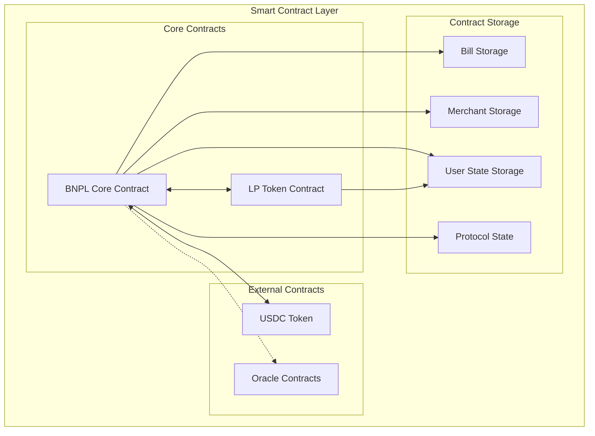

**BNPL Core Contract (`contracts/bnpl-core/`)** ✅ **[DONE]**
- **Language**: Rust (Soroban SDK) ✅
- **Functions**: 15+ public methods, 20+ internal methods ✅
- **State Management**: Persistent storage with TTL optimization ✅
- **Gas Optimization**: Batched operations, efficient data structures ⚠️ **[PARTIAL]**
- **Upgrade Pattern**: Proxy pattern for upgradability 📋 **[TODO]**

**LP Token Contract (`contracts/lp-token/`)** ✅ **[DONE]**
- **Standard**: SEP-41 compliant token ✅
- **Features**: Rebasing yields, collateral tracking, transfer restrictions ✅
- **Integration**: Tight coupling with BNPL Core for collateral management ✅

#### 1.2 Storage Architecture

```rust
// On-chain storage structure
pub struct Storage {
    bills: Map<u64, Bill>,                    // O(1) bill lookup
    merchants: Map<Address, MerchantData>,    // Merchant registry
    user_loans: Map<Address, Vec<u64>>,       // User loan tracking
    collateral: Map<Address, i128>,           // Locked collateral
    protocol_stats: ProtocolStats,            // Global metrics
    config: Config,                            // Protocol parameters
}
```

### 2. Application Layer

#### 2.1 Web Application Architecture

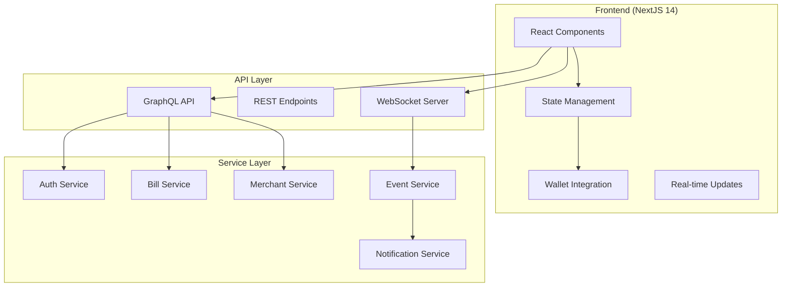

**Frontend Stack (`apps/web/`)** ✅ **[DONE]**
- **Framework**: Next.js 15 with App Router ✅
- **UI Library**: React 19 with Server Components ✅
- **Styling**: Tailwind CSS + Radix UI ✅
- **State Management**: Zustand + React Query ✅
- **Type Safety**: TypeScript 5.x with strict mode ✅

**API Architecture** ⚠️ **[PARTIAL]**
- **GraphQL**: Apollo Server for complex queries 📋 **[TODO]**
- **REST**: Next.js API Routes ✅ **[DONE]**
- **WebSocket**: Socket.io for real-time updates 📋 **[TODO]**
- **Authentication**: Wallet-based authentication ✅ **[DONE]**

#### 2.2 Service Layer Architecture

```typescript
// Microservices structure
interface ServiceArchitecture {
  billService: {
    responsibilities: ['bill_creation', 'payment_processing', 'status_updates'],
    database: 'mongodb://bills-db',
    cache: 'redis://bills-cache',
    queue: 'rabbitmq://bill-queue'
  },
  merchantService: {
    responsibilities: ['merchant_onboarding', 'kyb_verification', 'analytics'],
    database: 'mongodb://merchants-db',
    integrations: ['kyb_provider', 'risk_scoring']
  },
  eventService: {
    responsibilities: ['blockchain_monitoring', 'event_processing', 'state_sync'],
    infrastructure: 'event_streaming_platform',
    processing: 'parallel_with_ordering_guarantees'
  }
}
```

### 3. Data Layer

#### 3.1 Database Architecture

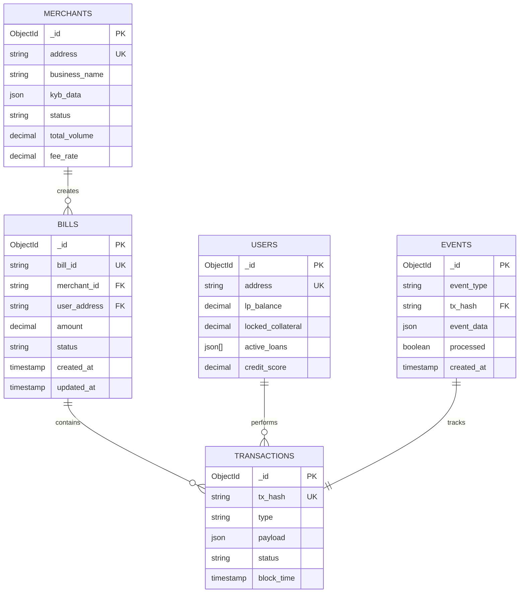

**MongoDB Collections** ⚠️ **[PARTIAL]**
- **bills**: Basic indexes ✅ **[DONE]**
- **merchants**: Basic search ✅ **[DONE]**
- **users**: Basic indexes ✅ **[DONE]**
- **transactions**: Basic storage ✅ **[DONE]**
- **events**: Event logging 🔄 **[DOING]**

#### 3.2 Caching Strategy 📋 **[TODO]**

```yaml
caching_layers:
  browser_cache: ✅ [DONE - Basic Next.js caching]
    - static_assets: 1_year
    - api_responses: 5_minutes
    - user_data: session_based

  cdn_cache: 📋 [TODO]
    - images: 30_days
    - scripts: 7_days
    - api_gateway: 60_seconds

  redis_cache: 📋 [TODO - Not implemented]
    - session_data: 24_hours
    - frequently_accessed: 1_hour
    - computation_results: 15_minutes

  database_cache: ⚠️ [PARTIAL - Basic Prisma caching]
    - query_cache: enabled
    - index_cache: 8GB
    - connection_pooling: 100_connections
```

## Technical Stack

### Core Technologies

| Layer | Technology | Version | Purpose | Status |
|-------|------------|---------|---------|--------|
| **Blockchain** | Stellar/Soroban | Latest | Smart contract platform | ✅ **[DONE]** |
| **Smart Contracts** | Rust | 1.75+ | Contract development | ✅ **[DONE]** |
| **Frontend** | Next.js | 15.x | Web application framework | ✅ **[DONE]** |
| **Runtime** | Node.js | 20.x LTS | JavaScript runtime | ✅ **[DONE]** |
| **Database** | MongoDB/Prisma | 7.x | Primary database | ✅ **[DONE]** |
| **Cache** | Redis | 7.x | Caching layer | 📋 **[TODO]** |
| **Message Queue** | RabbitMQ | 3.12+ | Event processing | 📋 **[TODO]** |
| **Search** | Elasticsearch | 8.x | Full-text search | 📋 **[TODO]** |
| **Monitoring** | Prometheus + Grafana | Latest | Metrics and visualization | 📋 **[TODO]** |
| **Container** | Docker | 24.x | Containerization | ⚠️ **[PARTIAL]** |
| **Orchestration** | Kubernetes | 1.28+ | Container orchestration | 📋 **[TODO]** |
| **CI/CD** | GitHub Actions | - | Automation pipeline | ⚠️ **[PARTIAL]** |

### Development Tools

```json
{
  "languages": ["TypeScript", "Rust", "JavaScript", "Python"],
  "testing": {
    "unit": "Jest, Vitest, cargo test",
    "integration": "Playwright, Cypress",
    "contract": "Soroban CLI test framework",
    "load": "K6, Artillery"
  },
  "linting": {
    "code": "ESLint, Prettier, Clippy",
    "commits": "Commitlint, Husky",
    "security": "Snyk, npm audit"
  },
  "documentation": {
    "api": "OpenAPI 3.0, GraphQL Schema",
    "code": "JSDoc, rustdoc",
    "architecture": "C4 model, Mermaid"
  }
}
```

## Architecture Patterns

### 1. Event-Driven Architecture 🔄 **[DOING]**

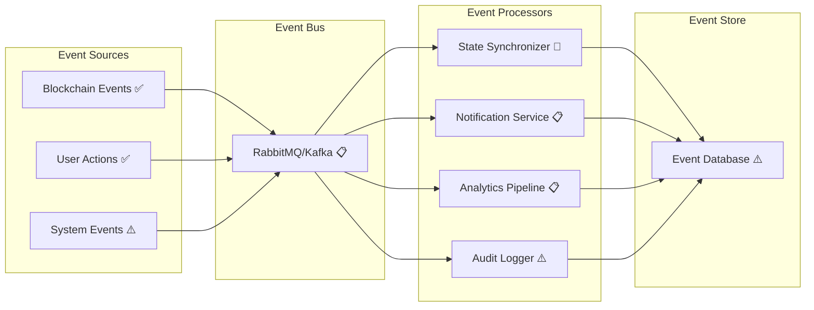

**Event Processing Pipeline**
1. **Event Detection**: Blockchain monitoring ✅, UI interactions ✅, system triggers 📋
2. **Event Routing**: Basic event handling ⚠️, priority queues 📋 **[TODO]**
3. **Event Processing**: Basic synchronous processing ⚠️, parallel processing 📋 **[TODO]**
4. **Event Storage**: Basic MongoDB storage ⚠️, immutable log 📋 **[TODO]**
5. **Event Replay**: Not implemented 📋 **[TODO]**

### 2. Microservices Architecture 📋 **[TODO]**

```yaml
services:
  api_gateway: 📋 [TODO]
    type: kong
    features: [rate_limiting, authentication, routing]

  bill_service: ⚠️ [PARTIAL - Monolithic implementation]
    pattern: aggregate_service
    database: shared_mongodb
    scaling: vertical_only

  merchant_service: ⚠️ [PARTIAL - Monolithic implementation]
    pattern: entity_service
    database: shared_mongodb
    integration: manual_kyb

  notification_service: 📋 [TODO]
    pattern: utility_service
    channels: [email, sms, push, in_app]

  analytics_service: 📋 [TODO]
    pattern: reporting_service
    database: time_series
    processing: batch_and_stream
```

### 3. Domain-Driven Design

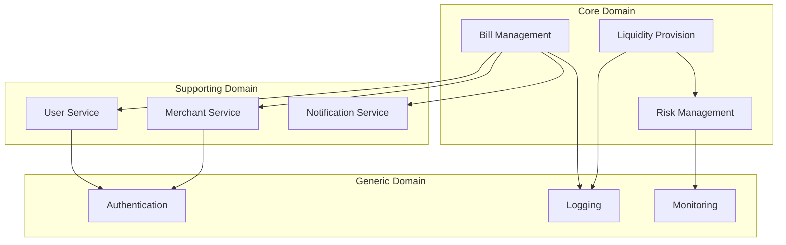

## Data Architecture

### 1. Data Flow Patterns

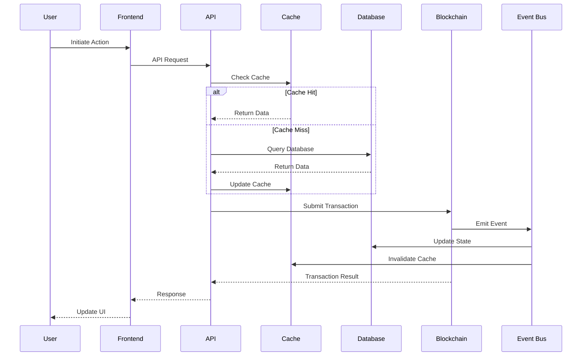

### 2. Data Consistency Model

**Consistency Levels**
- **Strong Consistency**: Blockchain state (single source of truth)
- **Eventual Consistency**: Off-chain database (synchronized via events)
- **Session Consistency**: User session data (cached per session)
- **Weak Consistency**: Analytics data (best-effort delivery)

**Conflict Resolution**
```typescript
interface ConflictResolution {
  strategy: 'blockchain_wins' | 'latest_write' | 'merge';
  blockchain_priority: 100;  // Always highest
  database_priority: 50;
  cache_priority: 10;
  resolution_time: '< 5 seconds';
}
```

### 3. Data Retention & Archival

```yaml
retention_policies:
  hot_data:
    location: primary_database
    retention: 90_days
    access_pattern: frequent

  warm_data:
    location: secondary_database
    retention: 1_year
    access_pattern: occasional
    compression: enabled

  cold_data:
    location: object_storage
    retention: 7_years
    access_pattern: rare
    compression: maximum
    encryption: at_rest

  compliance_data:
    location: immutable_storage
    retention: regulatory_requirement
    audit_trail: complete
    encryption: end_to_end
```

## Security Architecture

### 1. Security Layers

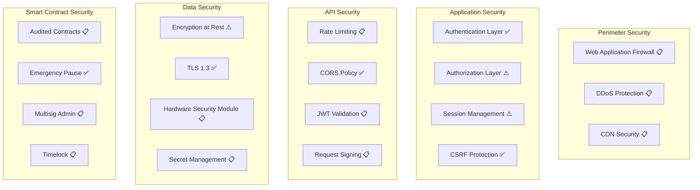

### 2. Security Controls

**Authentication & Authorization**
```typescript
interface SecurityControls {
  authentication: {
    methods: ['wallet_signature', 'jwt', 'oauth2'],
    mfa: ['totp', 'sms', 'hardware_key'],
    session_timeout: '30_minutes',
    refresh_token_rotation: true
  },
  authorization: {
    model: 'rbac_with_attributes',
    roles: ['user', 'merchant', 'admin', 'liquidator'],
    permissions: 'granular_per_resource',
    policy_engine: 'opa'
  },
  api_security: {
    rate_limiting: {
      anonymous: '10_requests_per_minute',
      authenticated: '100_requests_per_minute',
      merchant: '1000_requests_per_minute'
    },
    request_validation: 'json_schema',
    response_sanitization: true
  }
}
```

### 3. Threat Model

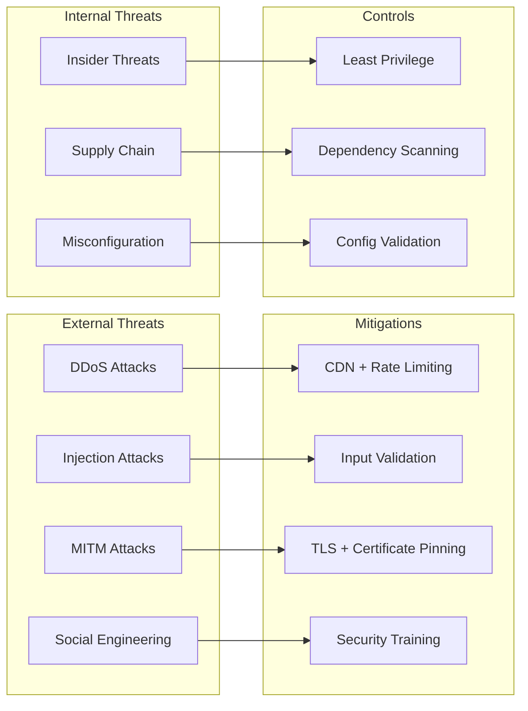

### 4. Compliance & Auditing

```yaml
compliance:
  standards:
    - ISO_27001: information_security
    - SOC2_Type2: service_organization_controls
    - GDPR: data_protection
    - PCI_DSS: payment_card_security

  audit_logging:
    what: [all_transactions, state_changes, admin_actions]
    where: immutable_audit_log
    retention: 7_years
    format: structured_json

  monitoring:
    security_events: real_time
    anomaly_detection: ml_based
    incident_response: automated_and_manual
    forensics: full_packet_capture
```

## Deployment Architecture

### 1. Infrastructure Architecture

#### Current State ⚠️ **[PARTIAL]**
- **Single Region Deployment**: Vercel/Railway hosting ✅
- **Database**: MongoDB Atlas (managed) ✅
- **No Kubernetes**: Serverless deployment ✅
- **No Redis Cache**: Direct database queries ⚠️

#### Target Architecture 📋 **[TODO]**

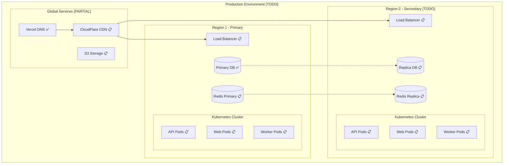

### 2. Kubernetes Architecture 📋 **[TODO - Not Implemented]**

```yaml
kubernetes:
  status: "📋 [TODO - Currently using Vercel serverless]"
  namespaces:
    - production:
        resources:
          - deployments: [web, api, workers]
          - services: [web-svc, api-svc]
          - ingress: [main-ingress]
          - configmaps: [app-config, env-config]
          - secrets: [api-keys, db-credentials]

  autoscaling:
    hpa:
      min_replicas: 3
      max_replicas: 50
      target_cpu: 70%
      target_memory: 80%

    vpa:
      update_mode: auto
      resource_policy: optimized

  resource_limits:
    web:
      requests: {cpu: 500m, memory: 1Gi}
      limits: {cpu: 2000m, memory: 4Gi}
    api:
      requests: {cpu: 1000m, memory: 2Gi}
      limits: {cpu: 4000m, memory: 8Gi}
    workers:
      requests: {cpu: 2000m, memory: 4Gi}
      limits: {cpu: 8000m, memory: 16Gi}
```

### 3. CI/CD Pipeline

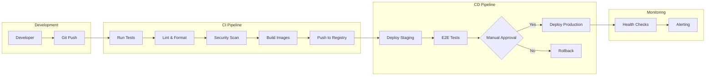

**Pipeline Stages**
```yaml
stages:
  - name: test
    parallel:
      - unit_tests
      - integration_tests
      - contract_tests
    coverage_threshold: 80%

  - name: build
    steps:
      - docker_build
      - vulnerability_scan
      - sbom_generation
    cache: enabled

  - name: deploy_staging
    strategy: blue_green
    smoke_tests: required
    rollback: automatic

  - name: deploy_production
    strategy: canary
    canary_percentage: 10
    monitoring_period: 30_minutes
    success_criteria:
      error_rate: "< 1%"
      response_time: "< 500ms"
```

## Integration Architecture

### 1. Merchant Integration Ecosystem 📋 **[TODO]**

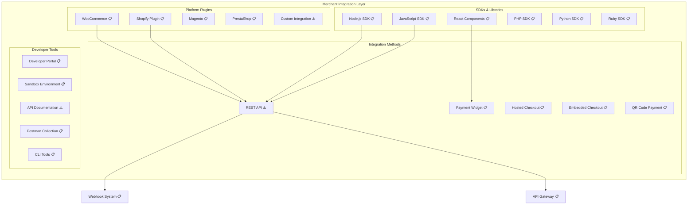

### 2. Merchant SDK Architecture 📋 **[TODO]**

```typescript
// @lumenlater/merchant-sdk
interface MerchantSDK {
  // SDK Initialization
  initialization: {
    apiKey: string,
    environment: 'sandbox' | 'production',
    webhookSecret: string,
    options: {
      timeout: number,
      retryPolicy: RetryPolicy,
      logging: boolean
    }
  },

  // Core Features
  features: {
    // Bill Management
    bills: {
      create: (params: BillParams) => Promise<Bill>,
      get: (billId: string) => Promise<Bill>,
      list: (filters: BillFilters) => Promise<Bill[]>,
      cancel: (billId: string) => Promise<void>
    },

    // Payment Widget
    checkout: {
      createSession: (params: CheckoutParams) => Promise<Session>,
      embedWidget: (containerId: string, options: WidgetOptions) => Widget,
      redirectToCheckout: (sessionId: string) => Promise<void>,
      handleCallback: (params: CallbackParams) => Promise<Result>
    },

    // Webhooks
    webhooks: {
      constructEvent: (payload: string, signature: string) => Event,
      handleEvent: (event: Event) => Promise<void>,
      verifySignature: (payload: string, signature: string) => boolean
    },

    // Analytics
    analytics: {
      getMetrics: (period: Period) => Promise<Metrics>,
      getTransactions: (filters: Filters) => Promise<Transaction[]>,
      exportData: (format: 'csv' | 'json') => Promise<Data>
    }
  },

  // SDK Status
  status: "📋 [TODO - Not implemented]"
}
```

### 3. Payment Widget Integration 📋 **[TODO]**

```javascript
// Merchant Website Integration Example
<script src="https://cdn.lumenlater.com/sdk/v1/lumenlater.js"></script>
<script>
  // Initialize LumenLater
  const lumenlater = new LumenLater({
    apiKey: 'pk_live_xxxxx',
    merchantId: 'merchant_xxxxx'
  });

  // Option 1: Embedded Checkout Widget
  lumenlater.checkout.embed({
    container: '#payment-container',
    amount: 99.99,
    currency: 'USDC',
    orderId: 'order_12345',
    customer: {
      email: 'customer@example.com',
      walletAddress: 'G...'
    },
    onSuccess: (result) => {
      console.log('Payment successful:', result);
    },
    onError: (error) => {
      console.error('Payment failed:', error);
    }
  });

  // Option 2: Redirect to Hosted Checkout
  lumenlater.checkout.redirect({
    items: [...],
    successUrl: 'https://merchant.com/success',
    cancelUrl: 'https://merchant.com/cancel'
  });

  // Option 3: Custom Integration
  const session = await lumenlater.checkout.createSession({...});
  const widget = lumenlater.ui.mountPaymentElement('#custom-payment');
</script>
```

### 4. Webhook System 📋 **[TODO]**

```yaml
webhook_architecture:
  events:
    bill_events:
      - bill.created
      - bill.paid
      - bill.repaid
      - bill.overdue
      - bill.liquidated

    merchant_events:
      - merchant.approved
      - merchant.suspended
      - merchant.settings_updated

    payment_events:
      - payment.initiated
      - payment.completed
      - payment.failed
      - payment.refunded

  delivery:
    retry_policy:
      attempts: 5
      backoff: exponential
      max_delay: 24_hours

    security:
      signature: HMAC-SHA256
      timestamp_validation: 5_minutes
      ip_whitelist: optional

    monitoring:
      success_rate: tracked
      latency: measured
      failures: alerted

  implementation: "📋 [TODO]"
```

### 5. E-commerce Platform Integrations 📋 **[TODO]**

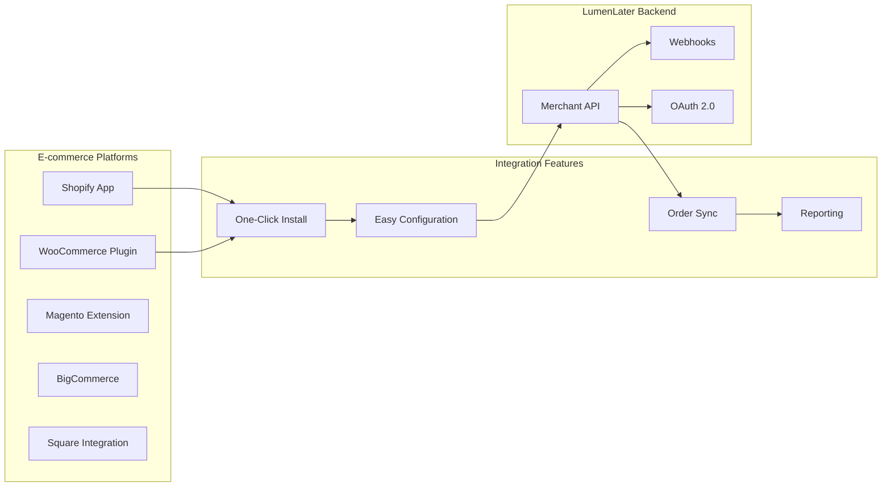

### 6. Developer Portal & Documentation 📋 **[TODO]**

```yaml
developer_portal:
  features:
    documentation:
      - API Reference
      - SDK Guides
      - Integration Tutorials
      - Code Examples
      - Video Tutorials

    tools:
      - API Explorer
      - Sandbox Environment
      - Test Card Numbers
      - Webhook Testing
      - Log Viewer

    resources:
      - Postman Collection
      - OpenAPI Spec
      - GraphQL Schema
      - Sample Applications
      - Migration Guides

    support:
      - Community Forum
      - Discord Channel
      - Stack Overflow Tag
      - GitHub Issues
      - Enterprise Support

  status: "📋 [TODO - Not implemented]"
```

### 7. External Integrations

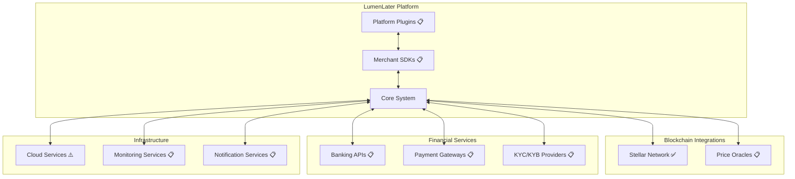

### 8. Merchant Dashboard 📋 **[TODO]**

```yaml
merchant_dashboard:
  features:
    analytics:
      - Transaction Volume
      - Conversion Rates
      - Average Order Value
      - Customer Demographics
      - Payment Performance

    management:
      - API Key Management
      - Webhook Configuration
      - Team Access Control
      - Billing & Invoices
      - Settings & Preferences

    reporting:
      - Real-time Transactions
      - Settlement Reports
      - Fee Calculations
      - Export Functions
      - Custom Reports

    tools:
      - Payment Link Generator
      - QR Code Generator
      - Invoice Creator
      - Refund Management
      - Dispute Resolution

  tech_stack:
    frontend: "Next.js + TypeScript"
    charts: "Recharts / D3.js"
    export: "CSV, PDF, Excel"
    realtime: "WebSocket updates"

  status: "📋 [TODO - Basic dashboard exists]"
```

### 9. Wallet Integration ✅ **[DONE]**

```typescript
interface WalletIntegration {
  supported_wallets: [
    'freighter', // ✅ [DONE]
    'xbull',     // ✅ [DONE]
    'albedo',    // ✅ [DONE]
    'rabet',     // ✅ [DONE]
    'stellar_wallet' // ✅ [DONE]
  ],
  connection_methods: [
    'browser_extension', // ✅ [DONE]
    'wallet_connect',    // ⚠️ [PARTIAL]
    'deep_linking'       // 📋 [TODO]
  ],
  signing_methods: [
    'transaction_signing', // ✅ [DONE]
    'message_signing',     // ✅ [DONE]
    'multi_signature'      // 📋 [TODO]
  ],
  fallback_strategy: 'stellar_wallet_sdk' // ✅ [DONE]
}
```

### 10. API Integration Patterns ⚠️ **[PARTIAL]**

```yaml
integration_patterns:
  synchronous:
    pattern: request_response
    timeout: 30_seconds
    retry: exponential_backoff
    circuit_breaker: enabled

  asynchronous:
    pattern: event_driven
    delivery: at_least_once
    ordering: partition_key
    dead_letter: enabled

  batch:
    pattern: bulk_processing
    schedule: cron_based
    error_handling: partial_failure
    monitoring: detailed_metrics

  streaming:
    pattern: continuous_flow
    protocol: websocket_or_sse
    reconnection: automatic
    buffering: client_side
```

## Performance & Scalability

### 1. Performance Metrics

```yaml
performance_targets:
  api_response_time:
    p50: 50ms
    p95: 200ms
    p99: 500ms

  page_load_time:
    first_contentful_paint: "< 1.5s"
    time_to_interactive: "< 3.5s"
    cumulative_layout_shift: "< 0.1"

  blockchain_operations:
    transaction_submission: "< 1s"
    confirmation_time: "3-5s"
    event_processing: "< 500ms"

  throughput:
    api_requests: "10,000 req/s"
    blockchain_transactions: "100 tx/s"
    event_processing: "50,000 events/s"
```

### 2. Scalability Strategy

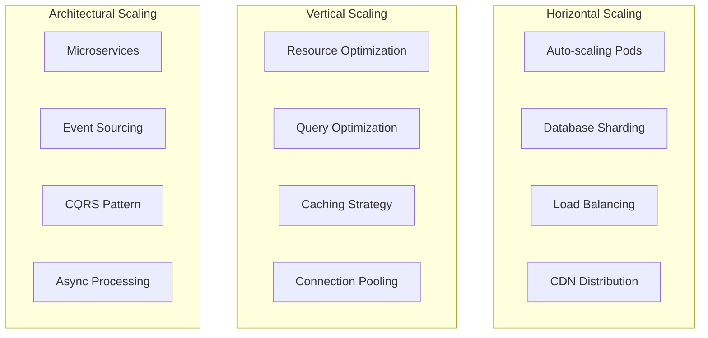

### 3. Optimization Techniques

```typescript
interface OptimizationTechniques {
  frontend: {
    code_splitting: true,
    lazy_loading: true,
    image_optimization: 'next/image',
    bundle_size: '< 200KB',
    prefetching: 'intelligent'
  },
  backend: {
    query_optimization: 'indexed',
    connection_pooling: {
      min: 10,
      max: 100
    },
    caching_layers: 3,
    batch_processing: true
  },
  smart_contracts: {
    storage_optimization: 'packed_structs',
    gas_optimization: 'batch_operations',
    state_rent: 'ttl_management'
  }
}
```

## Monitoring & Observability

### 1. Monitoring Stack

#### Current State ⚠️ **[PARTIAL]**
- **Basic Console Logging**: ✅
- **Vercel Analytics**: ✅
- **Error Tracking**: Basic error handling ⚠️
- **No APM**: Manual debugging only ⚠️

#### Target Architecture 📋 **[TODO]**

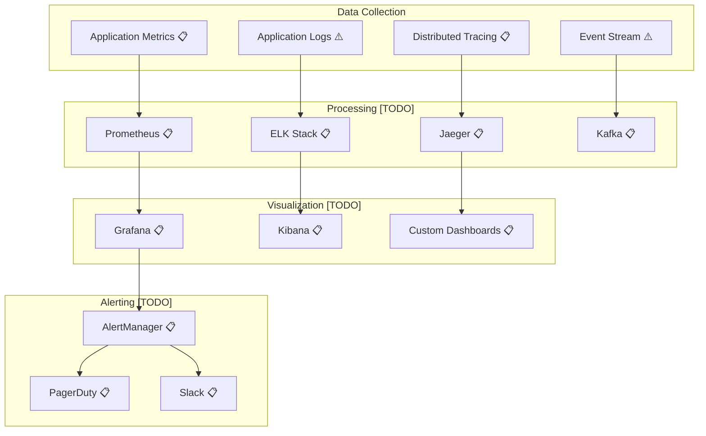

### 2. Key Metrics & KPIs

```yaml
business_metrics:
  - total_value_locked: real_time
  - active_users: daily_unique
  - transaction_volume: hourly_aggregate
  - merchant_adoption: weekly_growth
  - default_rate: rolling_30_day
  - yield_apr: real_time_calculation

technical_metrics:
  - system_uptime: 99.99%_target
  - error_rate: < 0.1%
  - response_time: p99 < 500ms
  - database_performance: query_time_histogram
  - blockchain_sync: lag < 5_seconds
  - event_processing: throughput_and_latency

security_metrics:
  - failed_auth_attempts: real_time_alert
  - suspicious_transactions: ml_anomaly_detection
  - api_abuse: rate_limit_violations
  - vulnerability_scan: weekly_automated
```

### 3. Logging Strategy

```typescript
interface LoggingStrategy {
  levels: ['ERROR', 'WARN', 'INFO', 'DEBUG', 'TRACE'],
  structured_format: {
    timestamp: 'ISO8601',
    level: 'string',
    service: 'string',
    trace_id: 'uuid',
    span_id: 'uuid',
    user_id: 'hashed',
    message: 'string',
    metadata: 'json'
  },
  retention: {
    hot: '7_days',
    warm: '30_days',
    cold: '1_year'
  },
  sampling: {
    error: '100%',
    warn: '100%',
    info: '10%',
    debug: '1%'
  }
}
```

## Disaster Recovery & Business Continuity

### 1. Backup Strategy

```yaml
backup_strategy:
  databases:
    frequency: continuous_replication
    point_in_time_recovery: 30_days
    backup_locations:
      - primary_region
      - secondary_region
      - cold_storage
    encryption: aes_256_gcm

  blockchain_state:
    method: event_sourcing
    storage: immutable_event_log
    verification: merkle_tree

  configuration:
    version_control: git
    secrets: vault_backup
    infrastructure: terraform_state

  testing:
    recovery_drill: monthly
    backup_verification: daily
    restore_time_objective: "< 1_hour"
```

### 2. Disaster Recovery Plan

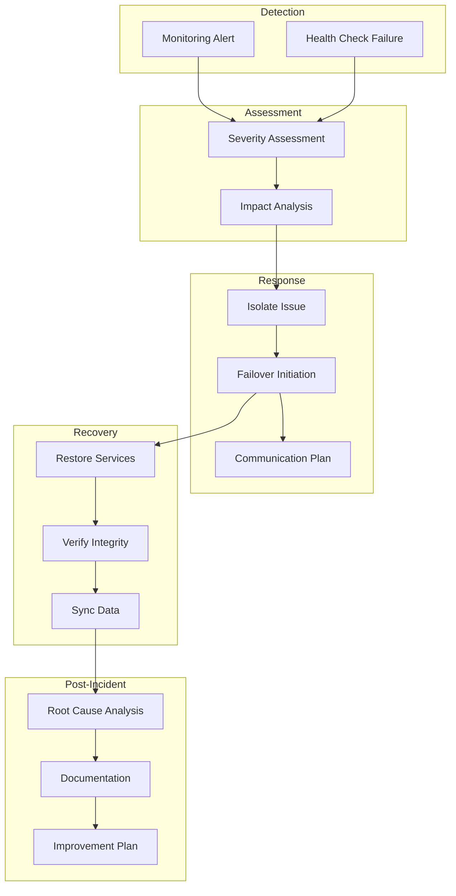

### 3. High Availability Architecture

```yaml
high_availability:
  architecture:
    pattern: active_active
    regions: 2
    availability_zones: 6

  load_balancing:
    algorithm: weighted_round_robin
    health_checks: every_5_seconds
    failover_time: "< 10_seconds"

  database:
    replication: synchronous
    consistency: strong
    failover: automatic

  recovery_objectives:
    rpo: "< 1_minute"  # Recovery Point Objective
    rto: "< 15_minutes" # Recovery Time Objective
    availability: "99.99%"
```

## Future Architecture Roadmap

### Phase 1: Foundation Enhancement (Q1 2025) 🔄 **[DOING]**
- [ ] Implement multi-region deployment 📋
- [ ] Add advanced monitoring and alerting 📋
- [ ] Enhance security with HSM integration 📋
- [ ] Implement automated testing pipeline ⚠️ (Basic tests exist)
- [ ] **Develop Merchant SDK (JavaScript/Node.js)** 📋
- [ ] **Create Payment Widget** 📋
- [ ] **Build Developer Portal** 📋

### Phase 2: Scalability Improvements (Q2 2025) 📋 **[TODO]**
- [ ] Migrate to microservices architecture 📋
- [ ] Implement event sourcing and CQRS 📋
- [ ] Add horizontal scaling capabilities 📋
- [ ] Optimize smart contract gas usage 📋
- [ ] **Launch E-commerce Platform Plugins (Shopify, WooCommerce)** 📋
- [ ] **Implement Webhook System** 📋
- [ ] **Add More SDK Languages (PHP, Python, Ruby)** 📋

### Phase 3: Advanced Features (Q3 2025) 📋 **[TODO]**
- [ ] Integrate AI/ML for risk scoring 📋
- [ ] Add cross-chain bridge support 📋
- [ ] Implement advanced oracle integration 📋
- [ ] Add multi-currency support 📋

### Phase 4: Enterprise Ready (Q4 2025) 📋 **[TODO]**
- [ ] Achieve SOC2 Type 2 compliance 📋
- [ ] Implement white-label solutions 📋
- [ ] Add advanced analytics platform 📋
- [ ] Complete regulatory compliance framework 📋

## Current vs Target Architecture Summary

### What's Built ✅
- **Smart Contracts**: BNPL Core, LP Token (Rust/Soroban)
- **Web Application**: Next.js 15 with React 19
- **Database**: MongoDB with Prisma ORM
- **Wallet Integration**: Stellar Wallets Kit (5+ wallets)
- **Basic UI**: Radix UI components with Tailwind CSS
- **Authentication**: Wallet-based auth
- **Deployment**: Vercel serverless
- **Basic Merchant Features**: Bill creation, basic dashboard

### In Progress 🔄
- **Event System**: Basic event handling, needs message queue
- **Security**: Basic security controls, needs enhancement
- **Testing**: Unit tests for contracts, needs E2E tests
- **Documentation**: Basic docs, needs comprehensive guides

### Not Yet Started 📋
- **Merchant SDK**: No official SDK for merchants
- **Payment Widget**: No embeddable checkout widget
- **E-commerce Plugins**: No Shopify/WooCommerce integration
- **Webhook System**: No event notification system
- **Developer Portal**: No documentation portal
- **API Gateway**: No centralized API management
- **Sandbox Environment**: No testing environment for merchants
- **Microservices**: Currently monolithic
- **Caching**: No Redis implementation
- **Message Queue**: No RabbitMQ/Kafka
- **Monitoring**: No Prometheus/Grafana
- **Container Orchestration**: No Kubernetes
- **Multi-region**: Single region deployment
- **Advanced Security**: No WAF, DDoS protection, HSM

## Conclusion

The LumenLater BNPL Protocol architecture represents a comprehensive, scalable, and secure foundation for decentralized consumer finance. By combining the transparency and efficiency of blockchain technology with the performance and user experience of modern web applications, the system provides a robust platform for the future of Buy-Now-Pay-Later services.

### Key Architectural Strengths
- **Hybrid Architecture**: Optimal balance between decentralization and performance
- **Security-First Design**: Multiple layers of security with automated risk management
- **Scalability**: Horizontal and vertical scaling capabilities
- **Observability**: Comprehensive monitoring and logging
- **Resilience**: High availability with disaster recovery

### Next Steps
1. Continue iterative improvements based on user feedback
2. Enhance monitoring and observability capabilities
3. Expand integration ecosystem
4. Optimize for cost and performance
5. Maintain security audits and compliance

---

*This document is a living artifact and will be updated as the architecture evolves. For the latest version, please refer to the project repository.*

*Last Updated: December 2024*
*Version: 1.0.0*