# System Architecture Overview

## Architecture Diagram

```mermaid
graph TD
    subgraph Users["👥 Users"]
        U1["Browse goods"]
        U2["Pay with BNPL"]
        U3["Repay loans"]
    end
    
    subgraph Merchants["🏪 Merchants"]
        M1["Create bills"]
        M2["Receive funds"]
        M3["Manage orders"]
    end
    
    subgraph LPs["💰 Liquidity Providers"]
        L1["Deposit USDC"]
        L2["Earn yield"]
        L3["Withdraw LP tokens"]
    end
    
    subgraph WebApp["🌐 Web Application"]
        W1["NextJS Frontend"]
        W2["Wallet Integration"]
        W3["Real-time Updates"]
        W4["Admin Dashboard"]
    end
    
    subgraph MongoDB["🗄️ MongoDB Database"]
        D1["Bill Records"]
        D2["Merchant Applications"]
        D3["User Profiles"]
        D4["Transaction Logs"]
    end
    
    subgraph Stellar["⭐ Stellar Blockchain"]
        subgraph BNPLCore["BNPL Core Contract"]
            B1["Bill management"]
            B2["BNPL processing"]
            B3["Merchant enrollment"]
            B4["Liquidation logic"]
        end
        
        subgraph LPToken["LP Token Contract"]
            P1["Liquidity pool shares"]
            P2["Yield distribution"]
            P3["Collateral tracking"]
        end
        
        USDCToken["USDC Token (External)"]
    end
    
    Users --> WebApp
    Merchants --> WebApp
    LPs --> WebApp
    WebApp --> MongoDB
    WebApp --> Stellar
```

## System Components

### 1. Smart Contracts Layer

#### BNPL Core Contract
The main protocol contract that handles:
- **Bill Management**: Create, pay, and repay bills
- **Merchant System**: Enrollment and status management
- **Risk Management**: Collateral calculation and liquidation
- **BNPL Processing**: Interest-free loan tracking and 14-day grace period

#### LP Token Contract
Liquidity provider token system:
- **Share Calculation**: Proportional ownership of the pool
- **Yield Distribution**: Revenue sharing from merchant fees
- **Collateral Tracking**: Locked balances for active BNPL loans

#### USDC Token (External)
Standard Stellar asset used for all payments - not developed by the protocol.

### 2. Application Layer

#### Frontend Application (NextJS)
- **User Interface**: Responsive web application
- **Wallet Integration**: Freighter, xBull, and other Stellar wallets
- **Real-time Updates**: Live transaction status and notifications
- **Admin Dashboard**: Merchant management and system monitoring

#### Database Layer (MongoDB)
- **Off-chain Data**: Bill metadata, user profiles, merchant information
- **Event Indexing**: Blockchain event caching for performance
- **Analytics**: Transaction history and protocol metrics

## Data Flow

### 1. Bill Creation Flow

1. Merchant creates a bill through web interface
2. Bill data stored in MongoDB with pending status
3. Transaction submitted to BNPL Core contract
4. Contract emits `bill_created` event
5. Event listener updates MongoDB with on-chain bill ID

### 2. Payment Flow

1. User approves USDC spending for BNPL contract
2. User pays bill through BNPL contract (0% interest)
3. Contract transfers USDC from LP pool to merchant (minus 1.5% fee)
4. Merchant fee distributed to LP holders
5. BNPL record created with 14-day repayment period

### 3. Repayment Flow

1. User approves USDC for repayment amount
2. Contract calculates repayment (principal only if within 14 days)
3. Funds transferred back to liquidity pool
4. User's LP collateral unlocked
5. Bill marked as repaid

## Security Architecture

### 1. Access Control

### 2. Risk Management

#### Over-collateralization
- Users must hold LP tokens as collateral
- Minimum 111% collateralization ratio (90% LTV)
- Collateral locked during active BNPL period

#### Liquidation System
- Liquidation available after 14-day grace period
- Health factor < 1.2 triggers liquidation eligibility
- 10% liquidation penalty to incentivize timely repayment

#### Interest-Free BNPL Model
- 0% interest for 14-day repayment period
- 30% APR late fee after grace period
- Revenue from 1.5% merchant processing fee

## Integration Points

### 1. Wallet Integration
- **Freighter**: Primary Stellar wallet
- **xBull**: Alternative wallet option
- **Custom Wallets**: Support for additional wallet types

### 2. Future Integrations
- **Oracle Services**: Price feeds and risk scoring
- **KYB/KYC Services**: Merchant and user verification
- **Analytics**: Advanced protocol performance tracking

## Scalability Considerations

### 1. Blockchain Layer
- **Stellar Network**: 3-5 second transaction finality
- **Low Fees**: ~$0.00001 per transaction
- **High Throughput**: 1000+ TPS capacity

### 2. Application Layer
- **Database Optimization**: MongoDB indexing for performance
- **Event-driven Updates**: Real-time blockchain event processing
- **Scalable Architecture**: NextJS with serverless deployment ready

### 3. Future Enhancements
See the protocol whitepaper for detailed roadmap and future features.

## Monitoring and Observability

### Key Metrics Tracked
- **Protocol Health**: TVL, active users, transaction volume
- **Performance**: Response times, gas usage, throughput
- **Business KPIs**: Merchant adoption, BNPL usage, LP yields
- **System Monitoring**: Health checks, error rates, uptime