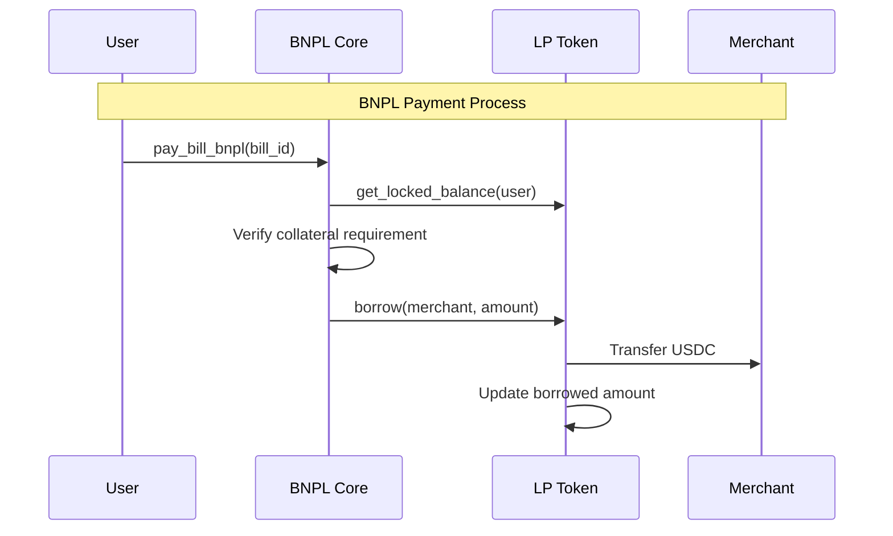
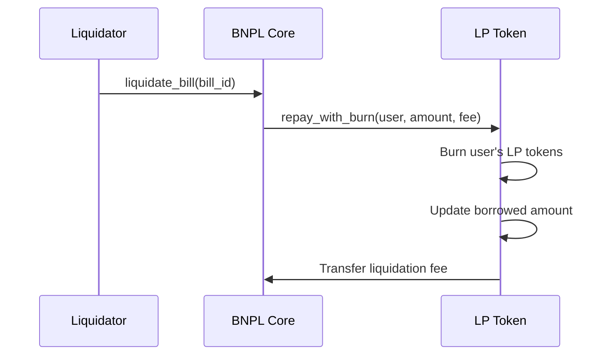

# LP Token Contract

The LP Token contract manages liquidity provider shares in the LumenLater BNPL Protocol using a rebasing mechanism.

## Contract Overview

| Property | Value |
|----------|--------|
| **Name** | Configurable via metadata |
| **Symbol** | Configurable via metadata |
| **Decimals** | 7 |
| **Language** | Rust (Soroban) |
| **Purpose** | Liquidity Pool Shares with Rebasing |

## Core Mechanism

The LP Token uses a **rebasing mechanism** to distribute yield automatically to all token holders. Key concepts:

- **Shares**: The actual stored value representing ownership percentage
- **Index**: A global multiplier that increases as yield accumulates
- **Balance**: The user-visible balance calculated as `shares × index`

This design allows yield to be distributed without requiring individual claims or transfers.

## Key Storage Elements

- **balances**: Map of user addresses to share amounts
- **user_index**: Map of user addresses to their last index update
- **index**: Global rebase index (starts at 1.0 with 9 decimals)
- **supply**: Total shares in circulation
- **borrowed**: Amount borrowed by BNPL Core
- **allowance**: Standard token allowances for transfers

## Public Functions

### Initialization

#### `initialize`
Initializes the LP token contract.

```rust
pub fn initialize(env: Env, admin: Address, underlying_asset: Address, metadata: TokenMetadata)
```

**Parameters:**
- `admin`: Administrator address
- `underlying_asset`: Address of the underlying asset (USDC)
- `metadata`: Token metadata (name, symbol)

**Access:** Admin only (first initialization)

### Token Standard Functions

#### `balance`
Returns the LP token balance of an address (rebased amount).

```rust
pub fn balance(env: Env, user: Address) -> i128
```

**Calculation:** `shares × current_index / user_index`

#### `total_supply`
Returns the total supply of LP tokens (rebased).

```rust
pub fn total_supply(env: Env) -> i128
```

**Calculation:** `total_shares × current_index`

#### `transfer`
Transfers LP tokens between addresses.

```rust
pub fn transfer(env: Env, from: Address, to: Address, amount: i128)
```

**Requirements:**
- Sufficient available balance (total - locked)
- From address must authorize

### Liquidity Management

#### `deposit`
Deposits underlying assets (USDC) and mints LP tokens.

```rust
pub fn deposit(env: Env, from: Address, amount: i128) -> i128
```

**Parameters:**
- `from`: Address depositing USDC
- `amount`: Amount of USDC to deposit

**Returns:** LP tokens minted (same as amount due to 1:1 initial rate)

**Process:**
1. Update index to distribute any accumulated yield
2. Transfer USDC from depositor to contract
3. Calculate shares to mint based on current index
4. Update user balance and index
5. Update total supply

#### `withdraw`
Burns LP tokens and returns underlying assets.

```rust
pub fn withdraw(env: Env, from: Address, lp_amount: i128) -> i128
```

**Parameters:**
- `from`: Address withdrawing
- `lp_amount`: LP tokens to burn

**Returns:** USDC amount withdrawn

**Requirements:**
- Sufficient available balance (total - locked)

**Process:**
1. Check available balance
2. Calculate shares to burn
3. Update user balance and total supply
4. Transfer USDC back to user

### BNPL Integration Functions

#### `set_bnpl_core`
Sets the BNPL Core contract address.

```rust
pub fn set_bnpl_core(env: Env, bnpl_core: Address)
```

**Access:** Admin only

#### `borrow`
Allows BNPL Core to borrow underlying assets.

```rust
pub fn borrow(env: Env, to: Address, amount: i128)
```

**Parameters:**
- `to`: Recipient of borrowed funds (usually merchant)
- `amount`: Amount to borrow

**Access:** BNPL Core only

**Process:**
1. Update borrowed amount tracking
2. Transfer USDC to recipient

#### `repay`
Allows BNPL Core to repay borrowed amount.

```rust
pub fn repay(env: Env, from: Address, amount: i128)
```

**Parameters:**
- `from`: Address repaying (user)
- `amount`: Amount to repay

**Access:** BNPL Core only

#### `repay_with_burn`
Repays loan by burning LP tokens (used in liquidation).

```rust
pub fn repay_with_burn(env: Env, from: Address, amount: i128, fee: i128)
```

**Parameters:**
- `from`: User being liquidated
- `amount`: Borrowed amount being repaid
- `fee`: Liquidation fee

**Access:** BNPL Core only

**Process:**
1. Burns LP tokens worth `amount + fee` from user
2. Updates borrowed amount
3. Transfers fee to BNPL Core

### Balance Management

#### `get_locked_balance`
Gets the locked LP tokens for a user based on BNPL Core requirements.

```rust
pub fn get_locked_balance(env: Env, user: Address) -> i128
```

**Returns:** Amount of LP tokens locked as collateral

#### `available_balance`
Gets available balance (total - locked).

```rust
pub fn available_balance(env: Env, user: Address) -> i128
```

**Returns:** Amount of LP tokens available for transfer/withdrawal

#### `get_balance_info`
Gets comprehensive balance information.

```rust
pub fn get_balance_info(env: Env, user: Address) -> (i128, i128, i128)
```

**Returns:** Tuple of (total, locked, available)

### Yield Distribution

#### `update_index`
Updates the rebasing index to distribute yield to all LP holders.

```rust
pub fn update_index(env: Env)
```

**Process:**
1. Calculate total assets (balance + borrowed)
2. Compare with expected value at current index
3. If excess exists, increase index proportionally
4. All LP holders automatically see increased balances

**Usage:**
1. Send yield (USDC) directly to the LP token contract
2. Call `update_index()` to distribute to all holders
3. No individual claims needed - balances automatically increase

### Query Functions

#### `exchange_rate`
Gets the current exchange rate (index).

```rust
pub fn exchange_rate(env: Env) -> u128
```

**Returns:** Current index value (how much 1 LP token is worth)

#### `underlying_asset`
Gets the underlying asset address.

```rust
pub fn underlying_asset(env: Env) -> Address
```

**Returns:** USDC token address

#### `total_underlying`
Gets total underlying assets held by the contract.

```rust
pub fn total_underlying(env: Env) -> i128
```

**Returns:** USDC balance in the contract

#### `total_borrowed`
Gets total amount borrowed by BNPL Core.

```rust
pub fn total_borrowed(env: Env) -> u128
```

**Returns:** Outstanding borrowed amount

#### `utilization_ratio`
Calculates current utilization ratio.

```rust
pub fn utilization_ratio(env: Env) -> u32
```

**Returns:** Utilization in basis points (10000 = 100%)

## LP Token Economics

### 1. Rebasing Mechanism

```mermaid
flowchart TD
    Start([Yield Arrives]) --> Detect[Contract receives USDC yield]
    Detect --> Update[Call update_index()]
    Update --> Calculate["new_index = (total_assets + borrowed) / total_shares"]
    Calculate --> Apply[All LP holders' balances increase]
    Apply --> Complete([Automatic distribution complete])
```

### 2. Share Price Evolution

The LP token maintains a dynamic exchange rate through its index:

```
Initial: 1 LP token = 1 USDC (index = 1.0)
After yield: 1 LP token = 1.05 USDC (index = 1.05)
```

This happens automatically without any user action required.

### 3. Yield Sources

- **Merchant Fees**: 1.5% fee from all BNPL transactions
- **Late Fees**: 30% APR on overdue loans (after 14 days)
- **Liquidation Fees**: 10% penalty on liquidated positions

All yield is automatically distributed to LP holders through the rebasing mechanism.

## Integration with BNPL Protocol

### 1. Collateral Management

The LP Token contract integrates with BNPL Core for collateral management:

1. **Collateral Locking**: LP tokens used as collateral are tracked but not physically moved
2. **Available Balance**: Users can only transfer/withdraw LP tokens not used as collateral
3. **Dynamic Tracking**: BNPL Core reports required collateral amounts in real-time

### 2. Lending Flow



### 3. Liquidation Process

When a loan becomes liquidatable:



## Events

The LP Token contract inherits standard token events from the TokenInterface:

- **Transfer**: Emitted on all token transfers
- **Approval**: Emitted when allowances are set
- **Mint**: Emitted when new tokens are minted
- **Burn**: Emitted when tokens are burned

Note: The contract uses a rebasing mechanism, so individual yield distribution events are not needed.

## Error Handling

The contract uses standard Soroban assertions for error handling:

- **"insufficient available balance"**: User doesn't have enough unlocked LP tokens
- **"insufficient balance"**: User doesn't have enough total LP tokens
- **"allowance exceeded"**: Spender exceeds approved amount
- **"insufficient balance for liquidation"**: Not enough LP tokens to cover liquidation

All other errors result in contract panics with descriptive messages.

## Storage Schema

### Core Storage Keys

```rust
// User data
balances: Map<Address, u128>      // User share amounts
usr_index: Map<Address, u128>     // User's last index update
allowance: Map<(Address, Address), u128>  // Transfer allowances

// Global state
index: u128         // Global rebase index
supply: u128        // Total shares in circulation
borrowed: u128      // Amount borrowed by BNPL Core

// Configuration
admin: Address      // Admin address
asset: Address      // Underlying asset (USDC)
bnpl_core: Address  // BNPL Core contract
metadata: TokenMetadata  // Token name and symbol
```

## Security Considerations

### 1. Collateral Protection

- LP tokens used as collateral cannot be transferred or withdrawn
- The contract queries BNPL Core for real-time collateral requirements
- Prevents users from removing collateral while loans are active

### 2. Access Control

- Only admin can initialize and set BNPL Core address
- Only BNPL Core can borrow, repay, and liquidate
- Users can only transfer their own tokens

### 3. Rebasing Security

- Index only increases, never decreases
- User balances are calculated lazily to prevent manipulation
- All users benefit proportionally from yield

## Key Features Summary

### Rebasing Token
- Automatic yield distribution through index updates
- No need for manual yield claims
- All holders benefit proportionally

### BNPL Integration
- Seamless collateral management
- Direct lending from liquidity pool
- Liquidation support with fee collection

### User Experience
- Simple deposit/withdraw interface
- Real-time balance updates
- Transparent collateral tracking

## Integration Guide

### For Liquidity Providers
1. Approve USDC spending
2. Call `deposit()` to receive LP tokens
3. LP tokens automatically increase in value as yield accrues
4. Call `withdraw()` to redeem LP tokens for USDC

### For BNPL Users
1. Hold LP tokens as collateral
2. Available balance = total balance - locked collateral
3. Cannot withdraw locked collateral until loans are repaid

### For Developers
1. Use standard TokenInterface for basic operations
2. Call `update_index()` after sending yield to the contract
3. Query `available_balance()` to check transferable amount