# LumenLater BNPL Protocol Whitepaper

## Abstract

LumenLater BNPL Protocol is a decentralized Buy-Now-Pay-Later (BNPL) system built on Stellar's Soroban smart contract platform. The protocol enables instant credit for users, revenue opportunities for merchants, and yield generation for liquidity providers through a novel three-party ecosystem powered by over-collateralized lending and automated risk management.

## 1. Introduction

### 1.1 The BNPL Market Opportunity

The global BNPL market has experienced explosive growth, reaching $120 billion in 2021 and projected to exceed $570 billion by 2028. Traditional BNPL services like Klarna, Afterpay, and Affirm have captured significant market share but face several limitations:

- **Centralized Risk**: Single points of failure and regulatory risks
- **Limited Transparency**: Opaque lending decisions and fee structures
- **Geographic Restrictions**: Limited global accessibility
- **Merchant Integration Complexity**: Difficult onboarding processes

### 1.2 The DeFi Solution

Decentralized Finance (DeFi) protocols have demonstrated the power of permissionless, transparent financial systems. However, existing DeFi lending protocols are primarily designed for sophisticated users and lack the consumer-friendly experience needed for mainstream BNPL adoption.

LumenLater BNPL Protocol bridges this gap by combining:
- The transparency and efficiency of DeFi
- The user experience of traditional BNPL
- The security of over-collateralized lending
- The yield opportunities of liquidity provision

## 2. Protocol Overview

### 2.1 Three-Party Ecosystem

```mermaid
graph TD
    subgraph U[Users 👤]
        U1["Browse & Purchase"]
        U2["Pay with BNPL"]
        U3["Repay Loans"]
        U4["Deposit Collateral"]
    end
    
    subgraph M[Merchants 🏪]
        M1["Create Bills"]
        M2["Receive Instant Payment"]
        M3["Manage Orders"]
        M4["Access Analytics"]
    end
    
    subgraph L[Liquidity Providers 💰]
        L1["Deposit USDC"]
        L2["Earn Yield"]
        L3["Stake LP Tokens"]
        L4["Manage Risk"]
    end
    
    subgraph "Protocol Core ⚙️"
        P1["Smart Contracts"]
        P2["Risk Management"]
        P3["Yield Distribution"]
        P4["Liquidation Engine"]
    end
    
    U <--> P1
    M <--> P1
    L <--> P1
    
    P1 --> P2
    P1 --> P3
    P1 --> P4
```



### 2.2 Key Benefits

#### For Users:
- **Instant Credit**: Purchase goods immediately with deferred payment
- **Interest-Free Period**: 14 days to repay without any interest charges
- **Transparent Terms**: Clear fees and repayment schedules
- **Global Access**: Available worldwide without geographic restrictions

#### For Merchants:
- **Instant Settlement**: Receive payment immediately upon sale
- **Increased Sales**: Offer flexible payment options to customers
- **Lower Risk**: Protocol handles all credit risk and collection
- **Easy Integration**: Simple API integration with existing systems

#### For Liquidity Providers:
- **Competitive Yields**: Earn returns from merchant fees and late penalties
- **Risk-Adjusted Returns**: Over-collateralized system ensures capital protection
- **Sustainable Revenue**: Earn from protocol fees without charging users interest
- **Governance Rights**: Participate in protocol decision-making

## 3. Technical Architecture

### 3.1 Smart Contract System

The protocol uses two main smart contracts that work together:

**BNPL Core Contract:**
- Creates and manages bills for purchases
- Handles merchant enrollment and verification
- Processes payments and repayments
- Manages risk assessment and liquidations
- Distributes fees to stakeholders

**LP Token Contract:**
- Manages liquidity pool shares
- Distributes yields to liquidity providers
- Handles collateral for borrowing
- Enables governance participation

### 3.2 Risk Management Framework (MVP Implementation)

The current MVP implementation focuses on simplified risk management:


**MVP Features:**
- Collateral-based approval (LP token holdings)
- Basic borrowing limits per user
- Grace period before liquidation
- *Future: Credit scoring, dynamic risk assessment*

### 3.3 Interest Model (Interest-Free BNPL)

Following traditional BNPL models, the protocol offers **interest-free** short-term credit:

- **User Interest**: 0% APR for on-time repayment
- **Repayment Period**: 14 days grace period
- **Late Fees**: Applied only after grace period expires
- **Merchant Fees**: Revenue comes from merchant fees, not user interest

**Revenue Model:**
- Merchant processing fees (1.5% of transaction)
- Late payment penalties (30% APR after grace period)
- Liquidation fees for uncollateralized positions

*Note: This differs from traditional lending protocols that charge interest from day one.*

### 3.4 Collateralization Model (Simplified)

**MVP Implementation:**
- **Collateral Asset**: LP tokens only
- **Minimum Collateral**: 111% of loan value
- **Grace Period**: 14 days for repayment
- **Liquidation**: Manual process initially

**Parameters:**
- **Loan-to-Value (LTV)**: 90% (111% over-collateralization)
- **Liquidation Threshold**: Health factor < 1.0
- **Grace Period**: 14 days after due date
- **Liquidation Grace Period**: 28 days total before liquidation

*Future versions will include automated liquidation and multiple collateral types.*

## 4. Economic Model

### 4.1 Revenue Model

The protocol generates revenue through:

#### Primary Revenue Sources:
- **Merchant Fees**: Processing fees for BNPL transactions
- **Late Payment Fees**: Applied after grace period
- **Liquidation Penalties**: From undercollateralized positions
- **Platform Fees**: Various protocol usage fees

#### Fee Distribution:
- **Liquidity Providers**: 70% of protocol revenue
- **Protocol Treasury**: 20% for development and operations
- **Insurance Fund**: 10% for protocol risk management

All fees are distributed automatically through smart contracts with transparent, immutable rules.

### 4.2 Token Economics (Framework)

#### LP Token Utility:
1. **Liquidity Provision**: Represent shares in the liquidity pool
2. **Collateral**: Required for borrowing BNPL credit
3. **Yield Earning**: Receive protocol revenue distributions
4. **Governance**: Participate in protocol decision-making

#### Economic Incentives:
- **Liquidity Providers**: Earn yield from protocol fees
- **Early Users**: Potential token rewards and incentives
- **Long-term Stakers**: Enhanced benefits for committed participants

*Token economics will evolve based on protocol growth and community governance.*

### 4.3 Sustainable Growth Model

The protocol focuses on sustainable, long-term growth:

- **Bootstrap Phase**: Initial incentives to attract users
- **Growth Phase**: Organic adoption through utility
- **Maturity Phase**: Self-sustaining revenue from operations

*Specific incentive programs and tokenomics will be developed through community governance as the protocol matures.*

## 5. Risk Management

### 5.1 Credit Risk Mitigation

#### Over-Collateralization:
Every loan is backed by 111% collateral in LP tokens, ensuring protocol solvency even in adverse scenarios.

#### Interest-Free Period:
Loans are interest-free for the first 14 days, with late fees only applying after the grace period:
- 0% interest during 14-day grace period
- 30% APR late fees after grace period expires
- Merchant fees (1.5%) fund the interest-free period

#### Liquidation Mechanism:
Manual liquidation process protects the protocol:
1. Health factor monitoring
2. 14-day grace period for repayment
3. 28-day total period before liquidation eligibility
4. LP token holders can initiate liquidations
5. Liquidation incentives for community participation

### 5.2 Market Risk Management

#### Diversification:
- Multiple merchant categories
- Geographic distribution
- Various loan sizes and terms
- Diverse liquidity provider base

#### Stress Testing:
Regular scenario analysis including:
- Market downturns
- Liquidity crises
- Regulatory changes
- Technology risks

#### Insurance Fund:
5% of protocol fees fund an insurance pool for:
- Smart contract risks
- Extreme market events
- Regulatory compliance costs
- Protocol upgrade expenses

### 5.3 Operational Risk Controls

#### Smart Contract Security:
- Comprehensive audits by leading firms
- Formal verification of critical functions
- Bug bounty programs
- Gradual feature rollouts

#### Governance Framework:
- Multi-signature admin controls
- Time-locked parameter changes
- Community voting mechanisms
- Emergency pause capabilities

## 6. Governance

### 6.1 Governance Token (HLP)

LP token holders participate in protocol governance through:

#### Voting Rights:
- Protocol parameter updates
- Fee structure modifications
- New feature proposals
- Treasury fund allocation

#### Proposal Process:
1. **Ideation**: Community discussion phase
2. **Formal Proposal**: Detailed implementation plan
3. **Voting Period**: 7-day voting window
4. **Execution**: Automatic implementation if passed
5. **Review**: Post-implementation assessment

### 6.2 Governance Parameters

Stakeholders can vote on:

#### Economic Parameters:
- Fee percentages and distribution
- Collateralization requirements
- Grace period duration
- Liquidation parameters

#### Operational Parameters:
- Merchant approval criteria
- Credit scoring algorithms
- Grace period duration
- Staking reward multipliers

#### Strategic Decisions:
- New asset support
- Partnership agreements
- Protocol upgrades
- Community growth initiatives

## 7. Technology Stack

### 7.1 Blockchain Infrastructure

**Stellar Network Benefits:**
- Fast finality (3-5 seconds)
- Low transaction costs (~$0.00001)
- Built-in token features
- Regulatory-friendly design
- Sustainable consensus mechanism

**Soroban Smart Contracts:**
- Rust-based development
- WebAssembly execution
- Formal verification support
- Gas efficiency optimization
- Native token integration

### 7.2 Application Architecture

The LumenLater BNPL Protocol features a simple, user-friendly architecture:

**User Interfaces:**
- Web application for merchants and users
- Developer SDKs for easy integration
- Mobile apps (planned for future release)

**Core Infrastructure:**
- Smart contracts on Stellar's Soroban platform
- USDC token integration for payments
- Secure data storage and caching
- Real-time event processing and notifications

**Key Benefits:**
- Fast transaction processing (3-5 seconds)
- Low costs (~$0.00001 per transaction)
- High security through blockchain technology
- Easy integration for merchants

### 7.3 Security Framework

LumenLater BNPL implements comprehensive security measures:

**Smart Contract Security:**
- Comprehensive code audits
- Extensive testing on testnet
- Gradual feature rollouts
- Emergency pause capabilities

**User Protection:**
- Minimal data collection
- Transparent terms and conditions
- User-controlled permissions
- Regulatory compliance

## 8. Roadmap

### 8.1 Phase 1: Foundation (Q1-Q2 2024)
- ✅ Core smart contract development
- ✅ Web application MVP
- ✅ Initial security audits
- ✅ Testnet deployment and testing
- 🔄 Mainnet launch preparation

### 8.2 Phase 2: Growth (Q3-Q4 2024)
- 🔄 Mainnet launch with limited features
- 📋 Merchant onboarding program
- 📋 Liquidity provider incentives
- 📋 Mobile application development
- 📋 Integration partnerships

### 8.3 Phase 3: Expansion (Q1-Q2 2025)
- 📋 Additional payment methods
- 📋 Advanced credit scoring
- 📋 Institutional partnerships
- 📋 Enhanced user features
- 📋 Regulatory compliance framework

### 8.4 Phase 4: Maturity (Q3-Q4 2025)
- 📋 Global merchant network
- 📋 Multi-currency support
- 📋 Advanced features
- 📋 Full community governance
- 📋 Sustainable ecosystem growth

## 9. Competitive Analysis

### 9.1 Traditional BNPL Providers

| Feature | LumenLater BNPL | Klarna | Afterpay | Affirm |
|---------|-------------|---------|----------|---------|
| **Decentralization** | ✅ Fully | ❌ Centralized | ❌ Centralized | ❌ Centralized |
| **Global Access** | ✅ Worldwide | 🔶 Limited | 🔶 Limited | 🔶 Limited |
| **Transparent Fees** | ✅ On-chain | 🔶 Some hidden | 🔶 Some hidden | ✅ Transparent |
| **Yield Opportunities** | ✅ LP rewards | ❌ None | ❌ None | ❌ None |
| **Instant Settlement** | ✅ 3-5 seconds | 🔶 1-3 days | 🔶 1-3 days | 🔶 1-3 days |
| **Collateral Required** | ✅ LP tokens | ❌ Credit only | ❌ Credit only | ❌ Credit only |

### 9.2 DeFi Lending Protocols

| Feature | LumenLater BNPL | Aave | Compound | MakerDAO |
|---------|-------------|------|----------|----------|
| **Consumer Focus** | ✅ BNPL UX | ❌ DeFi native | ❌ DeFi native | ❌ DeFi native |
| **Merchant Integration** | ✅ Built-in | ❌ None | ❌ None | ❌ None |
| **Fixed Terms** | ✅ Predictable | 🔶 Variable | 🔶 Variable | 🔶 Variable |
| **Instant Liquidity** | ✅ Immediate | 🔶 Market dependent | 🔶 Market dependent | 🔶 Limited |
| **Credit Building** | ✅ On-chain history | ❌ None | ❌ None | ❌ None |

## 10. Legal and Regulatory Considerations

### 10.1 Regulatory Framework

#### Current Status:
- Operating under existing DeFi regulations
- Monitoring regulatory developments
- Engaging with legal experts
- Building compliance infrastructure

#### Key Considerations:
- **Consumer Protection**: Clear terms, fair lending practices
- **Anti-Money Laundering**: KYC/AML compliance where required
- **Securities Law**: Token classification and distribution
- **Data Privacy**: GDPR, CCPA compliance

### 10.2 Risk Disclosures

#### Smart Contract Risks:
- Code vulnerabilities despite auditing
- Network congestion during high usage
- Smart contract upgrade considerations
- Integration dependencies

#### Market Risks:
- Token price volatility
- Liquidity fluctuations
- Interest rate changes
- Regulatory changes

#### Operational Risks:
- Key personnel dependency
- Technology failures
- Cyber security threats
- Third-party service risks

## 11. Conclusion

LumenLater BNPL Protocol represents a paradigm shift in consumer finance, combining the accessibility of traditional BNPL services with the transparency, efficiency, and yield opportunities of decentralized finance. By creating a three-party ecosystem where users, merchants, and liquidity providers all benefit, the protocol establishes a sustainable foundation for growth and innovation.

The over-collateralized lending model ensures protocol security while the interest-free period provides value to users and the fee structure creates sustainable revenue. Built on Stellar's fast and cost-effective infrastructure, LumenLater BNPL is positioned to capture significant market share in the rapidly growing BNPL sector.

As the protocol evolves from its current foundation phase toward mainstream adoption, the governance framework ensures community-driven development while maintaining the security and reliability necessary for handling consumer financial services at scale.

The future of finance is decentralized, transparent, and accessible to all. LumenLater BNPL Protocol is building that future today.

---

## Appendix

### A. Mathematical Models (Current Implementation)

#### Borrowing Power Calculation:
```
Max_Borrowing = LP_Balance × 90%
Available_Borrowing = Max_Borrowing - Current_Debt

where:
LP_Balance = User's LP token balance (1:1 with USDC)
Current_Debt = Outstanding BNPL principal + late fees
```

#### Required Collateral:
```
Required_Collateral = Total_Debt × 111%

where:
Total_Debt = Outstanding principal + accumulated late fees
Collateral_Ratio = 111% (over-collateralization)
```

#### Late Fee Calculation:
```
Late_Fee = (Principal × 30% APR × Days_Overdue) / 365

where:
Days_Overdue = days after 14-day grace period
Late fees only apply after grace period expires
```

#### Health Factor:
```
Health_Factor = Max_Borrowing / Current_Debt

Liquidation threshold: 28 days after bill creation
Health factor monitoring for risk assessment
```

*All calculations use precise scaling factors in smart contracts for accuracy.*

### B. Contract Addresses

#### Testnet:
- BNPL Core: `CB35QWU7M7IJCAP3L7HPACQRV23LI3SGF35DXTLOGWNFLZBNR4XPYH65`
- USDC Token: `CCWP65JEXNKOUO6YGPDBDUFLNEUPXJEL75WESLEOPZAIWLPFXW5KUZBX`
- LP Token: `CAVNVTR65IGZTF4WBR24BYGK7CLRR26TXNXLNOBZXYPYRN4TV5FLMAQ4`

#### Mainnet:
- TBD upon mainnet launch

### C. Security & Audits

**Current Status:**
- Internal security review: Completed
- Comprehensive testing: Ongoing
- External audit: Planned before mainnet launch
- Bug bounty program: Launching with mainnet

**Security Measures:**
- Multi-signature admin controls
- Emergency pause capabilities
- Gradual feature rollouts
- Continuous monitoring

### D. References

1. BNPL Market Research - GlobalData, 2023
2. DeFi Total Value Locked - DeFiPulse, 2023
3. Stellar Network Documentation - stellar.org
4. Soroban Smart Contracts - soroban.stellar.org
5. Consumer Finance Regulations - Various jurisdictions

*This whitepaper is subject to updates as the protocol develops. The latest version is always available at docs.LumenLater-protocol.com*